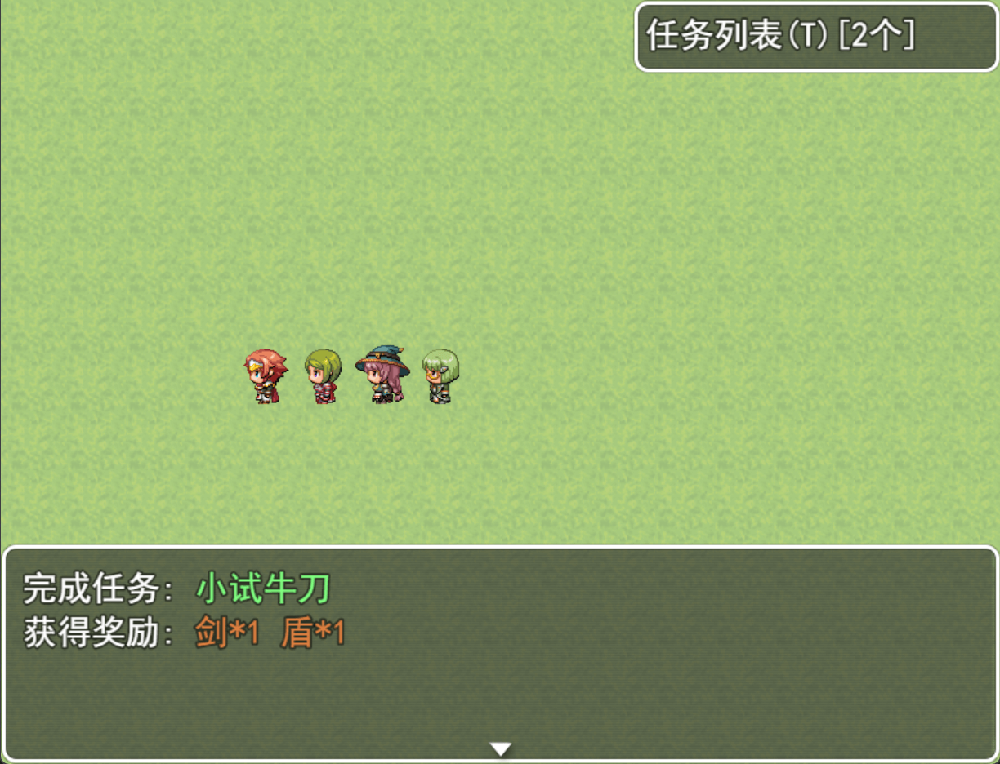

# RPG Maker MV 任务系统插件
## 一、插件简介
本插件为 RPG Maker MV 提供简单易用的任务管理功能，支持任务列表展示、任务添加与完成控制，以及任务未完成时的行进限制等操作。

## 二、效果展示

## 三、核心功能
- **任务状态可视化**：实时显示任务列表及完成进度，支持窗口折叠/展开。
- **任务指令灵活控制**：通过插件命令添加主线/支线任务、完成任务逻辑，以及未完成任务时的地图行进限制。

## 四、安装步骤
1. **文件放置**：下载 `TaskSystem.js` 插件文件，复制到 RPG Maker MV 项目的 `js/plugins` 目录下。
2. **插件启用**：打开 RPG Maker MV，在「插件管理器」中找到该插件并勾选启用。

## 五、插件命令详解
可下载本项目并用 RPG Maker MV 打开查看插件命令的具体实现和使用示例。
以下是插件支持的命令类型及其格式示例：
| 命令类型      | 格式示例                                   | 功能说明                           |  
|-----------|----------------------------------------|--------------------------------|  
| 完成任务      | `FinishTask [任务名称]`                    | 标记任务为完成状态，触发奖励发放（如金币、道具等）。     |  
| 添加主线任务    | `AddMainTask [任务名称] [任务内容] [奖励金币数量]`   | 添加玩家不可拒绝的主线任务，自动加入任务列表。        |  
| 添加普通支线任务  | `AddNormalTask [任务名称] [任务内容] [奖励金币数量]` | 添加可选择拒绝的支线任务，玩家可自主决定是否接取。      |  
| 任务未完成禁止行进 | `RefuseIfNotFinish [任务名称]`             | 在方格事件中设置限制：若指定任务未完成，玩家无法到达该方格。 |  

## 六、使用指南
1. **任务窗口操作**：按键盘 `T` 键快速打开/折叠任务列表窗口。
2. **列表滚动方式**：
    - 鼠标滚轮滚动查看超出窗口高度的任务内容。
    - 键盘方向键（↑/↓）逐行滚动。
3. **滚动提示**：当窗口未显示全部内容时，底部会显示倒三角图标（▼）作为提示。

## 七、注意事项
- **任务名称唯一性**：每个任务的名称必须唯一，避免指令冲突。
- **参数格式要求**：所有命令参数中禁止包含空白字符（如空格、制表符等），确保指令正确执行。